# Actividad 1 módulo de Big Data Aplicado. Opción Neo4j

## Ejercicio 1
Diseño de un grafo, de temática libre, compuesto por seis nodos. Para las ponderaciones de las aristas tomaremos valores que vayan en consonancia con el contenido elegido.

En mi caso he elegido un grafo con las capitales de provincia de Andalucía y su unión por autovía, teniendo en cuenta la distancia en km, el tiempo en minutos y el nombre de la autovía. Como requisito, sólo he tenido en cuenta las conexiones que sólo toman una autovía

## Ejercicio 2

### 2.a) Crea el grafo en Neo4j

Los nodos los he llamado "ciudad", con tres propiedades: nombre, latitud y longitud (necesarios para el Algoritmo A*)
Las relaciones las he llamado "camino" con tres propiedades: km, tiempo y autovía.

    CREATE
    (AL:ciudad {name: 'Almeria', latitud: 36.84016, longitud: -2.467922}),
    (CA:ciudad {name: 'Cadiz', latitud: 36.52969, longitud: -6.292657}),
    (CO:ciudad {name: 'Cordoba', latitud: 37.88473, longitud: -4.779152}),
    (GR:ciudad {name: 'Granada', latitud: 37.17649, longitud: -3.597929}),
    (HU:ciudad {name: 'Huelva', latitud: 37.2571, longitud: -6.949555}),
    (JA:ciudad {name: 'Jaen', latitud: 37.76574, longitud: -3.789518}),
    (MA:ciudad {name: 'Malaga', latitud: 37.20783, longitud: -4.658073}),
    (SE:ciudad {name: 'Sevilla', latitud: 37.38264, longitud: -5.996295}),

    (AL)-[:camino {km: 167, tiempo: 107, autovia: 'A92'}]->(GR),
    (GR)-[:camino {km: 167, tiempo: 107, autovia: 'A92'}]->(AL),

    (AL)-[:camino {km: 200, tiempo: 129, autovia: 'A7'}]->(MA),
    (MA)-[:camino {km: 200, tiempo: 129, autovia: 'A7'}]->(AL),

    (CA)-[:camino {km: 121, tiempo: 77, autovia: 'A4'}]->(SE),
    (SE)-[:camino {km: 121, tiempo: 77, autovia: 'A4'}]->(CA),

    (CO)-[:camino {km: 147, tiempo: 93, autovia: 'A4'}]->(JA),
    (JA)-[:camino {km: 147, tiempo: 93, autovia: 'A4'}]->(CO),

    (CO)-[:camino {km: 160, tiempo: 111, autovia: 'A45'}]->(MA),
    (MA)-[:camino {km: 160, tiempo: 111, autovia: 'A45'}]->(CO),

    (CO)-[:camino {km: 143, tiempo: 99, autovia: 'A4'}]->(SE),
    (SE)-[:camino {km: 143, tiempo: 99, autovia: 'A4'}]->(CO),

    (GR)-[:camino {km: 92, tiempo: 63, autovia: 'A44'}]->(JA),
    (JA)-[:camino {km: 92, tiempo: 63, autovia: 'A44'}]->(GR),

    (GR)-[:camino {km: 124, tiempo: 92, autovia: 'A92'}]->(MA),
    (MA)-[:camino {km: 124, tiempo: 92, autovia: 'A92'}]->(GR),

    (GR)-[:camino {km: 248, tiempo: 158, autovia: 'A92'}]->(SE),
    (SE)-[:camino {km: 248, tiempo: 158, autovia: 'A92'}]->(GR),

    (HU)-[:camino {km: 93, tiempo: 66, autovia: 'A49'}]->(SE),
    (SE)-[:camino {km: 93, tiempo: 66, autovia: 'A49'}]->(HU);

Si queremos introducir las relaciones como no dirigidas hay que hacerlo después de crear los nodos de la siguiente forma:

    match (AL:ciudad {name: 'Almeria'})
    match (GR:ciudad {name: 'Granada'})
    merge (AL)-[:camino{km: 167, tiempo: 107, autovia: 'A92'}]-(GR)

    match (AL:ciudad {name: 'Almeria'})
    match (MA:ciudad {name: 'Malaga'})
    merge (AL)-[:camino {km: 200, tiempo: 129, autovia: 'A7'}]-(MA)

    match (CA:ciudad {name: 'Cadiz'})
    match (SE:ciudad {name: 'Sevilla'})
    merge (CA)-[:camino {km: 121, tiempo: 77, autovia: 'A4'}]-(SE)

    match (CO:ciudad {name: 'Cordoba'})
    match (JA:ciudad {name: 'Jaen'})
    merge (CO)-[:camino {km: 147, tiempo: 93, autovia: 'A4'}]-(JA)

    match (CO:ciudad {name: 'Cordoba'})
    match (MA:ciudad {name: 'Malaga'})
    merge (CO)-[:camino {km: 160, tiempo: 111, autovia: 'A45'}]-(MA)

    match (CO:ciudad {name: 'Cordoba'})
    match (SE:ciudad {name: 'Sevilla'})
    merge (CO)-[:camino {km: 143, tiempo: 99, autovia: 'A4'}]-(SE)

    match (GR:ciudad {name: 'Granada'})
    match (JA:ciudad {name: 'Jaen'})
    merge (GR)-[:camino {km: 92, tiempo: 63, autovia: 'A44'}]-(JA)

    match (GR:ciudad {name: 'Granada'})
    match (MA:ciudad {name: 'Malaga'})
    merge (GR)-[:camino {km: 124, tiempo: 92, autovia: 'A92'}]-(MA)

    match (GR:ciudad {name: 'Granada'})
    match (SE:ciudad {name: 'Sevilla'})
    merge (GR)-[:camino {km: 248, tiempo: 158, autovia: 'A92'}]-(SE)

    match (HU:ciudad {name: 'Huelva'})
    match (SE:ciudad {name: 'Sevilla'})
    merge (HU)-[:camino {km: 93, tiempo: 66, autovia: 'A49'}]-(SE)

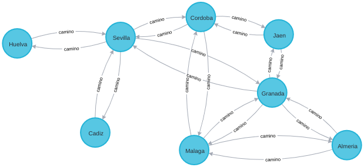

***Importante***

_Para mostrar los datos y el grafo generado, debemos ejecutar la siguiente instruccion_

    match(n) return(n)

_Y para borralos todos_

    match(n) detach delete(n)

_Para la realización de todos los ejercicios he consultado la documentación oficial. Es de gran ayuda. La enlazo en cada uno de los ejercicios_

### 2.b) Recórrelo en anchura[(BRF)](https://neo4j.com/docs/graph-data-science/current/algorithms/bfs/) y profundidad[DFS](https://neo4j.com/docs/graph-data-science/current/algorithms/dfs/).
_Tomaremos siempre como nodo de punto de partida Córdoba_

1. Recorrido en Anchura teniendo en cuenta la distancia

Primero creamos el grafo base para luego aplicarle algorintmos predefinidos con los siguientes parámetros: nombre del grafo(b_anchura_cordoba), nombre de los nodos(ciudad) y la relacion(camino) junto con la propiedad que vas a usar para ello(km). Este sólo hay que crearlo una vez

    CALL gds.graph.create('b_anchura_cordoba', 'ciudad', 'camino', { relationshipProperties: 'km' })

Después realizamos la busqueda en anchura

    MATCH (a:ciudad {name: 'Cordoba'})
    WITH id(a) AS startNode
    CALL gds.alpha.bfs.stream('b_anchura_cordoba', {startNode: startNode})
    YIELD path 
    UNWIND [ n in nodes(path) | n.name ] AS tags 
    RETURN tags

Comentarios sobre cada instrucción

    MATCH (a:ciudad {name: 'Cordoba'}) //Buscamos el nodo que se va a comportar como inicio y le ponemos una clave a su valos(a)

    WITH id(a) AS startNode // Decimos que este nodo sera el "starNode"

    CALL gds.alpha.bfs.stream('b_anchura_cordoba', {startNode: startNode}) //Indicamos al algoritmo BRF cual es el nodo inicio
    YIELD path 

    UNWIND [ n in nodes(path) | n.name ] AS tags  //Recorremos los nodos obteniendo la propiedad nombre de los nodos

    RETURN tags // Los devolvemos

    ORDER BY tags  //Se ordenan. Esta sentencia no la necesitamos si queremos que salgan los datos en busqueda en anchura

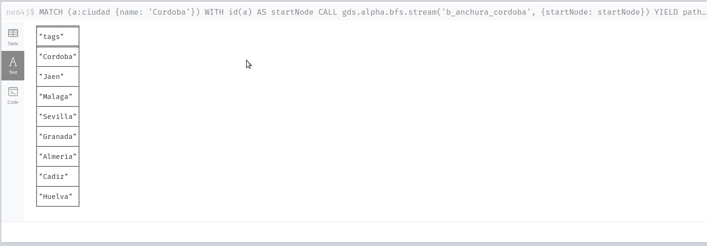

2. Recorrido en Profundidad teniendo en cuenta la distancia
   
Primero creamos el grafo tipo busqueda en anchura(BRF)con los siguientes parámetros: nombre del grafo(b_anchura_cordoba), nombre de los nodos(ciudad) y la relacion(camino) junto con la propiedad que vas a usar para ello(km). Este sólo hay que crearlo una vez

    CALL gds.graph.create('b_profundidad_cordoba', 'ciudad', 'camino', { relationshipProperties: 'km' })

Después realizamos la busqueda en profundidad

    MATCH (a:ciudad {name: 'Cordoba'})
    WITH id(a) AS startNode
    CALL gds.alpha.dfs.stream('b_profundidad_cordoba', {startNode: startNode})
    YIELD path 
    UNWIND [ n in nodes(path) | n.name ] AS tags 
    RETURN tags

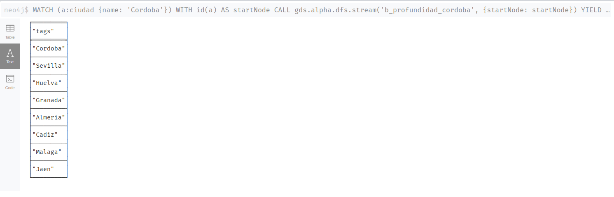

### Ejercicio 2.c) Obtén el camino mínimo, utilizando el [algoritmo de Dijkstra, entre un nodo y los restantes](https://neo4j.com/docs/graph-data-science/current/algorithms/dijkstra-single-source/).

1. Algoritmo de Dijkstra teniendo en cuenta la distancia
   
Primero creamos el grafo que voy a usar para el Algoritmo de Dijkstra utilizando como coste la propiedad km. Recuerda que estos sólo se crean la primera vez

    CALL gds.graph.create('Mydijkstra_km', 'ciudad', 'camino', { relationshipProperties: 'km' })

Algoritmo de Dijkstra teniendo en cuenta la distancia

    MATCH (source:ciudad {name: 'Cordoba'})
    CALL gds.allShortestPaths.dijkstra.stream('Mydijkstra_km', {
        sourceNode: source,
        relationshipWeightProperty: 'km'
    })
    YIELD index, sourceNode, targetNode, totalCost, nodeIds, costs, path
    RETURN
        index,
        gds.util.asNode(sourceNode).name AS sourceNodeName,
        gds.util.asNode(targetNode).name AS targetNodeName,
        totalCost,
        [nodeId IN nodeIds | gds.util.asNode(nodeId).name] AS nodeNames,
        costs,
        nodes(path) as path
    ORDER BY index

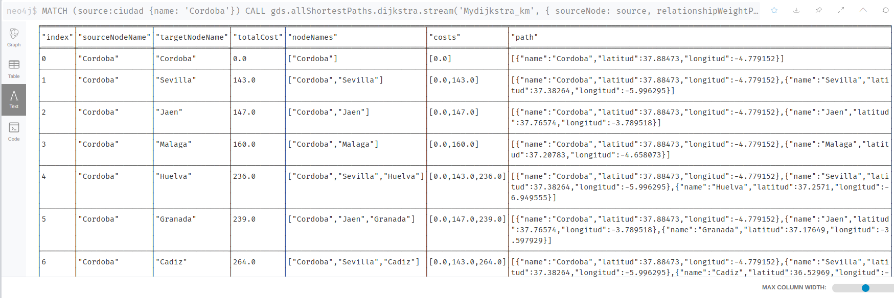

2. Algoritmo de Dijkstra teniendo en cuenta el tiempo

Podemos hacerlo creando el grafo para el Algoritmo de Dijkstra utilizando como coste la propiedad tiempo

    CALL gds.graph.create('Mydijkstra_tiempo', 'ciudad', 'camino', { relationshipProperties: 'tiempo' })

Algoritmo de Dijkstra teniendo en cuenta el tiempo

    MATCH (source:ciudad {name: 'Cordoba'})
    CALL gds.allShortestPaths.dijkstra.stream('Mydijkstra_tiempo', {
        sourceNode: source,
        relationshipWeightProperty: 'tiempo'
    })
    YIELD index, sourceNode, targetNode, totalCost, nodeIds, costs, path
    RETURN
        index,
        gds.util.asNode(sourceNode).name AS sourceNodeName,
        gds.util.asNode(targetNode).name AS targetNodeName,
        totalCost,
        [nodeId IN nodeIds | gds.util.asNode(nodeId).name] AS nodeNames,
        costs,
        nodes(path) as path
    ORDER BY index

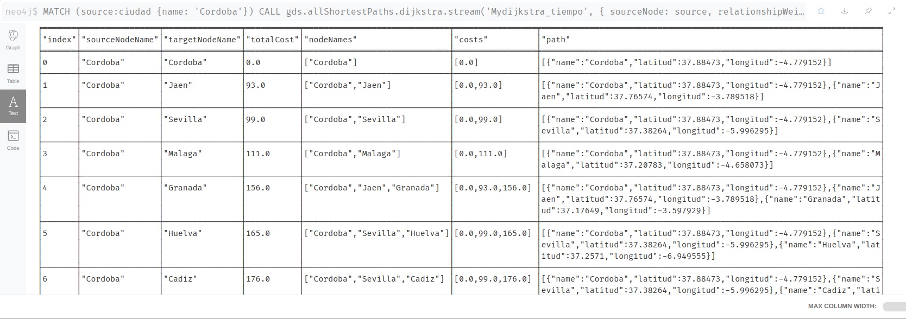

### Ejercicio 2.d) Calcula el camino mínimo, utilizando el [algoritmo de Dijkstra](https://neo4j.com/docs/graph-data-science/current/algorithms/dijkstra-source-target/) y el [algoritmo A*](https://neo4j.com/docs/graph-data-science/current/algorithms/astar/), entre dos nodos elegidos.

1. Dijkstra entre dos nodos elegidos por distancia.

Primero creamos el grafo que voy a usar para el Algoritmo de Dijkstra utilizando como coste la propiedad km

    CALL gds.graph.create('Mydijkstra_target_km', 'ciudad', 'camino', { relationshipProperties: 'km' })

A partir de aquí ya podemos aplicar el algoritmo de Dijkstra entre dos nodos.

 - Córdoba-Cádiz por distancia

_Código_

    MATCH (source:ciudad {name: 'Cordoba'}), (target:ciudad {name: 'Cadiz'})
    CALL gds.shortestPath.dijkstra.stream('Mydijkstra_target_km', {
        sourceNode: source,
        targetNode: target,
        relationshipWeightProperty: 'km'
    })
    YIELD index, sourceNode, targetNode, totalCost, nodeIds, costs, path
    RETURN
        index,
        gds.util.asNode(sourceNode).name AS sourceNodeName,
        gds.util.asNode(targetNode).name AS targetNodeName,
        totalCost,
        [nodeId IN nodeIds | gds.util.asNode(nodeId).name] AS nodeNames,
        costs,
        nodes(path) as path
    ORDER BY index

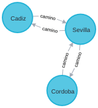
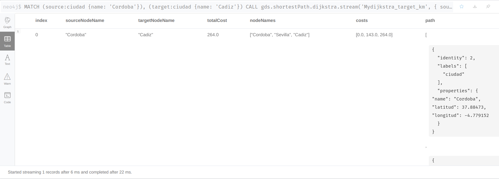

  - Huelva-Almería por distancia

_Código_

    MATCH (source:ciudad {name: 'Huelva'}), (target:ciudad {name: 'Almeria'})
    CALL gds.shortestPath.dijkstra.stream('Mydijkstra_target_km', {
        sourceNode: source,
        targetNode: target,
        relationshipWeightProperty: 'km'
    })
    YIELD index, sourceNode, targetNode, totalCost, nodeIds, costs, path
    RETURN
        index,
        gds.util.asNode(sourceNode).name AS sourceNodeName,
        gds.util.asNode(targetNode).name AS targetNodeName,
        totalCost,
        [nodeId IN nodeIds | gds.util.asNode(nodeId).name] AS nodeNames,
        costs,
        nodes(path) as path
    ORDER BY index

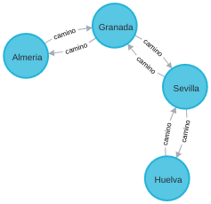
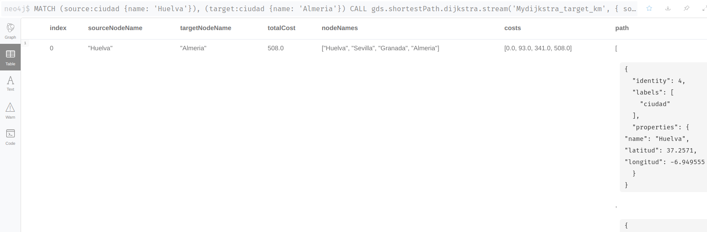

Así todos los ejemplos que queramos indicando el nodo origen y objetivo, en este caso ciudades.

Por supuesto, también se puede hacer teniendo en cuenta otro coste/propiedad como el tiempo

2. Dijkstra entre dos nodos elegidos por distancia

Creamos el grafo

    CALL gds.graph.create('Mydijkstra_target_tiempo', 'ciudad', 'camino', { relationshipProperties: 'tiempo' })

 - Córdoba-Cádiz por tiempo
  
_Código_

    MATCH (source:ciudad {name: 'Cordoba'}), (target:ciudad {name: 'Cadiz'})
    CALL gds.shortestPath.dijkstra.stream('Mydijkstra_target_tiempo', {
        sourceNode: source,
        targetNode: target,
        relationshipWeightProperty: 'tiempo'
    })
    YIELD index, sourceNode, targetNode, totalCost, nodeIds, costs, path
    RETURN
        index,
        gds.util.asNode(sourceNode).name AS sourceNodeName,
        gds.util.asNode(targetNode).name AS targetNodeName,
        totalCost,
        [nodeId IN nodeIds | gds.util.asNode(nodeId).name] AS nodeNames,
        costs,
        nodes(path) as path
    ORDER BY index

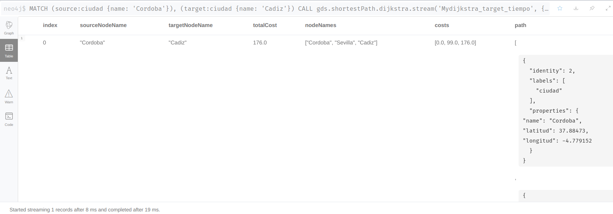

  - Huelva-Almería por tiempo

_Código_

    MATCH (source:ciudad {name: 'Huelva'}), (target:ciudad {name: 'Almeria'})
    CALL gds.shortestPath.dijkstra.stream('Mydijkstra_target_tiempo', {
        sourceNode: source,
        targetNode: target,
        relationshipWeightProperty: 'tiempo'
    })
    YIELD index, sourceNode, targetNode, totalCost, nodeIds, costs, path
    RETURN
        index,
        gds.util.asNode(sourceNode).name AS sourceNodeName,
        gds.util.asNode(targetNode).name AS targetNodeName,
        totalCost,
        [nodeId IN nodeIds | gds.util.asNode(nodeId).name] AS nodeNames,
        costs,
        nodes(path) as path
    ORDER BY index

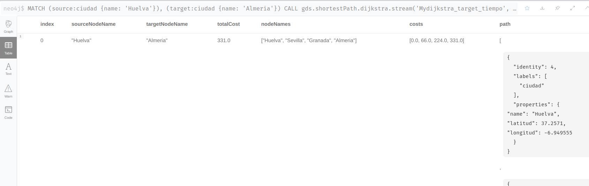

3. A* entre dos nodos elegidos

Este algoritmo necesita la latitud y la longitud para poder aplicar su heurística

Primero creamos el grafo que voy a usar para el Algoritmo de A* utilizando como coste las propiedades km y tiempo. Este grafo me va a servir para el uso del algoritmo en ámbas propiedades

    CALL gds.graph.create(
        'A_target',
        'ciudad',
        'camino',
        {
            nodeProperties: ['latitud', 'longitud'],
            relationshipProperties: ['km', 'tiempo']
        }
    )

  - A* Córdoba a Cádiz teniendo en cuenta km

_Código_

    MATCH (source:ciudad {name: 'Cordoba'}), (target:ciudad {name: 'Cadiz'})
    CALL gds.shortestPath.astar.stream('A_target', {
        sourceNode: source,
        targetNode: target,
        latitudeProperty: 'latitud',
        longitudeProperty: 'longitud',
        relationshipWeightProperty: 'km'
    })
    YIELD index, sourceNode, targetNode, totalCost, nodeIds, costs, path
    RETURN
        index,
        gds.util.asNode(sourceNode).name AS sourceNodeName,
        gds.util.asNode(targetNode).name AS targetNodeName,
        totalCost,
        [nodeId IN nodeIds | gds.util.asNode(nodeId).name] AS nodeNames,
        costs,
        nodes(path) as path
    ORDER BY index

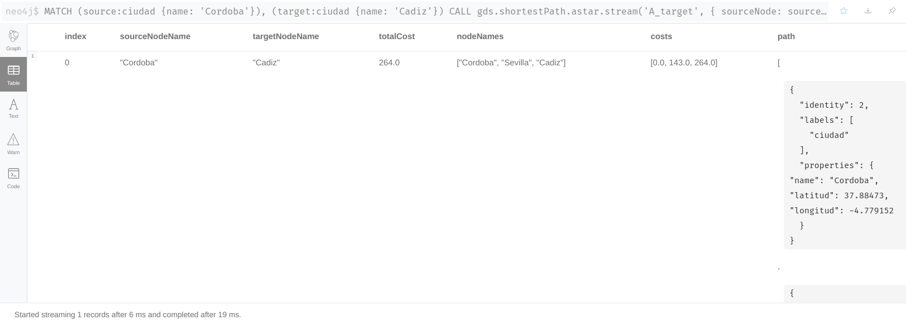

  - A* Córdoba a Cádiz teniendo en cuenta tiempo

_Código_

    MATCH (source:ciudad {name: 'Cordoba'}), (target:ciudad {name: 'Cadiz'})
    CALL gds.shortestPath.astar.stream('A_target', {
        sourceNode: source,
        targetNode: target,
        latitudeProperty: 'latitud',
        longitudeProperty: 'longitud',
        relationshipWeightProperty: 'tiempo'
    })
    YIELD index, sourceNode, targetNode, totalCost, nodeIds, costs, path
    RETURN
        index,
        gds.util.asNode(sourceNode).name AS sourceNodeName,
        gds.util.asNode(targetNode).name AS targetNodeName,
        totalCost,
        [nodeId IN nodeIds | gds.util.asNode(nodeId).name] AS nodeNames,
        costs,
        nodes(path) as path
    ORDER BY index

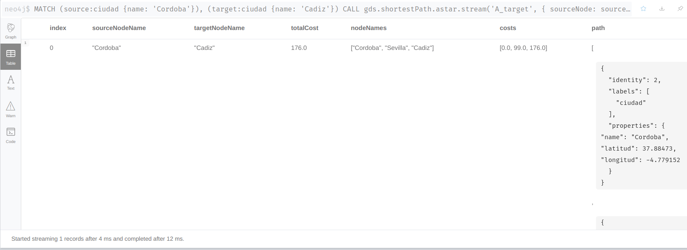

  - A* Huelva a Almería teniendo en cuenta km

_Código_

    MATCH (source:ciudad {name: 'Huelva'}), (target:ciudad {name: 'Almeria'})
    CALL gds.shortestPath.astar.stream('A_target', {
        sourceNode: source,
        targetNode: target,
        latitudeProperty: 'latitud',
        longitudeProperty: 'longitud',
        relationshipWeightProperty: 'km'
    })
    YIELD index, sourceNode, targetNode, totalCost, nodeIds, costs, path
    RETURN
        index,
        gds.util.asNode(sourceNode).name AS sourceNodeName,
        gds.util.asNode(targetNode).name AS targetNodeName,
        totalCost,
        [nodeId IN nodeIds | gds.util.asNode(nodeId).name] AS nodeNames,
        costs,
        nodes(path) as path
    ORDER BY index

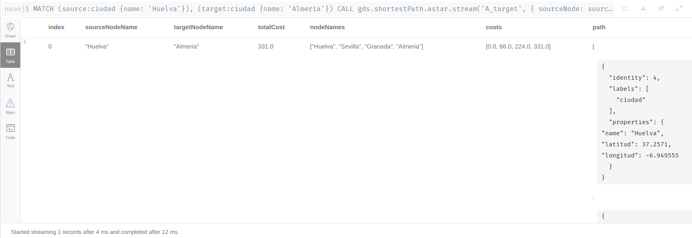

  - A* Huelva a Almería teniendo en cuenta tiempo

_Código_

    MATCH (source:ciudad {name: 'Huelva'}), (target:ciudad {name: 'Almeria'})
    CALL gds.shortestPath.astar.stream('A_target', {
        sourceNode: source,
        targetNode: target,
        latitudeProperty: 'latitud',
        longitudeProperty: 'longitud',
        relationshipWeightProperty: 'tiempo'
    })
    YIELD index, sourceNode, targetNode, totalCost, nodeIds, costs, path
    RETURN
        index,
        gds.util.asNode(sourceNode).name AS sourceNodeName,
        gds.util.asNode(targetNode).name AS targetNodeName,
        totalCost,
        [nodeId IN nodeIds | gds.util.asNode(nodeId).name] AS nodeNames,
        costs,
        nodes(path) as path
    ORDER BY index

### Ejercicio 2.e) Borra el grafo completo.

    match(n) detach delete(n)

## Ejercicio 3

Diseña e implementa en Neo4j un grafo que represente una red social conformada por ti y cuatro amigos más. Hecho esto, obtén las medidas de centralidad de grado, cercanía e intermediación para cada uno de los nodos.

    CREATE
    (CA:user {nick: 'Camen'}),
    (LO:user {nick: 'Lourdes'}),
    (JA:user {nick: 'Jaime'}),
    (JR:user {nick: 'JoseRamon'}),
    (RA:user {nick: 'Rafa'}),

    (CA)-[:follow]->(LO),
    (LO)-[:follow]->(CA),
    (CA)-[:follow]->(RA),
    (CA)-[:follow]->(JR),
    (LO)-[:follow]->(JA),
    (LO)-[:follow]->(JR),
    (JR)-[:follow]->(LO),
    (JA)-[:follow]->(CA),
    (JA)-[:follow]->(JR),
    (JR)-[:follow]->(JA),
    (JA)-[:follow]->(RA),
    (RA)-[:follow]->(JA),
    (JR)-[:follow]->(RA),
    (RA)-[:follow]->(JR)

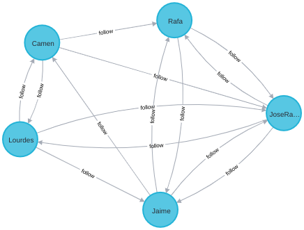

### Cálculo de la [centralidad de grado](https://neo4j.com/docs/graph-data-science/current/algorithms/degree-centrality/)

Creamos el grafo para la centralidad de grado para estos nodos. Como no tenemos ninguna propiedad/coste/puntución en la relación, no hay que indicarla. Si la quisieramos tener en cuenta habría que añadirla dentro de follow de la siguiente forma: 

    CALL gds.graph.create(
    'centralidad_grado',
    'user',
    {
        follow: {
        orientation: 'REVERSE'
        }
    }
    )

_Como no tenemos ninguna propiedad/coste/puntución en la relación, no hay que indicarla. Si la quisieramos tener en cuenta habría que añadirla dentro de follow de la siguiente forma:_

    FOLLOWS: {
      orientation: 'REVERSE',
      properties: ['score']

Cálculo de la centralidad de Grado

    CALL gds.degree.stream('centralidad_grado')
    YIELD nodeId, score
    RETURN gds.util.asNode(nodeId).nick AS nick, score AS follow
    ORDER BY follow DESC, nick DESC

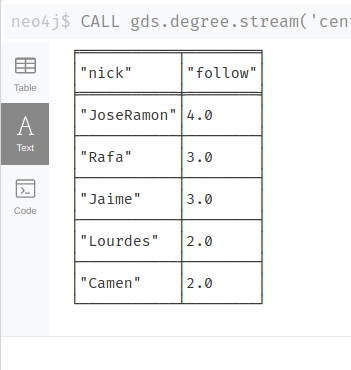

### Cálculo de la [cercanía](https://neo4j.com/docs/graph-data-science/current/algorithms/closeness-centrality/)

Creamos el grafo para la cercania para estos nodos. En este caso podemos hacer la creación implícita del nodo, crearla y usarla en la misma sentencia.

    CALL gds.alpha.closeness.stream({
    nodeProjection: 'user',
    relationshipProjection: 'follow'
    })
    YIELD nodeId, centrality
    RETURN gds.util.asNode(nodeId).nick AS user, centrality
    ORDER BY centrality DESC

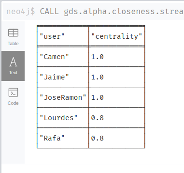

### Cálculo de la [indeterminación](https://neo4j.com/docs/graph-data-science/current/algorithms/betweenness-centrality/)

Creamos el grafo para la indeterminación para estos nodos.

    CALL gds.graph.create('indeterminacion', 'user', 'follow')

Cálculo de la indeterminación del grafo

    CALL gds.betweenness.stream('myGraph')
    YIELD nodeId, score
    RETURN gds.util.asNode(nodeId).nick AS nick, score
    ORDER BY nick ASC

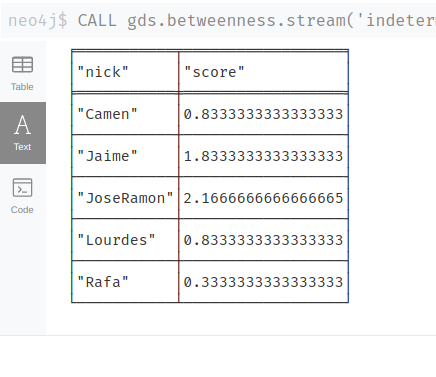

***Reflexiones***

Usando como base estos ejercicios, podemos ampliarlos y/o modificarlos. Por ejemplo:

1. Ciudades:
   - Añadiendo más ciudades
   - Dando un score dependiendo del tipo de carreteras (autovía, secundarias,...)
   - Modificando los valores para provocar resultados diferentes

2. Redes Sociales:
   - Añadiendo más nodos
   - Añadiendo propiedades a la relación

***Cualquier sugerencia, advertencia de error o cualquier otro aporte será más que bienvenido***

